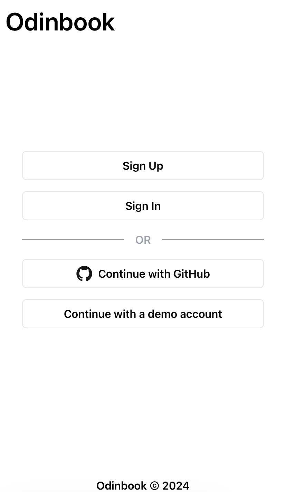
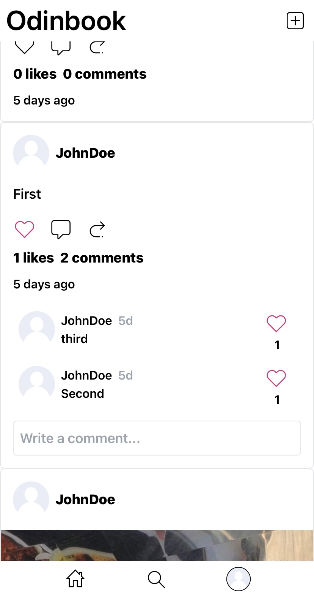
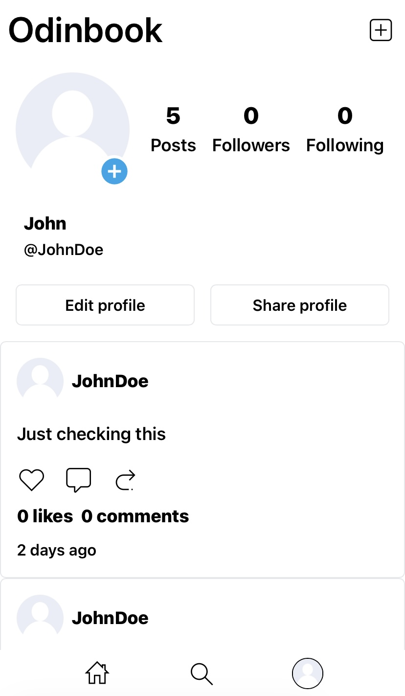

# Odinbook Client Side
This this a social media web application built using the MERN stack (MongoDB, Express.js, React.js, Node.js) along with the Tailwind CSS framework for styling.
Check out the [server-side repo](https://github.com/LaythAlqadhi/odin-book-server-side).

## Preview
Check out the web application [Odinbook](https://odinbook-eight.vercel.app) to explore its features.

## Screenshots





## Pages
- Authentication page
- Home page
- Search page
- Profile page
- Follow requests page
- Not Found Page

## Features
- Unauthenticated users cannot access private routes.
- Sign in or sign up using GitHub authentication method.
- Sign in and sign up forms with immediate input validation using the Constraint Validation API.
- Users can add post using text or images or either.
- Users can like posts and comments.
- Users can share posts amd profiles.
- Users can comment on posts
- Posts display the post content, author, comments, and likes.
- Home page shows the recents posts.
- Search page shows users by their name or username with buttons for sending follow requests to users the user is not already following or have a pending request or unfollow.
- The user's profile page features their profile information, profile photo, posts, and buttons customized to their role. For owners, these buttons allow editing and sharing of their profiles, whereas visitors can send follow requests to users the user is not already following or have a pending request or unfollow.

## Installation

1. **Clone the Repository:**
   ```bash
   git clone <repository_url>
   cd <repository_directory>
   ```

2. **Install Dependencies:**
   ```bash
   npm install
   ```

   or

   ```bash
   yarn install
   ```

3. **Development:**
   To start the development server, run:
   ```bash
   npm run dev
   ```

   or

   ```bash
   yarn dev
   ```

4. **Building the Application:**
   To build the application for production, run:
   ```bash
   npm run build
   ```

   or

   ```bash
   yarn build
   ```

5. **Previewing the Build:**
   To preview the production build locally, run:
   ```bash
   npm run preview
   ```

   or

   ```bash
   yarn preview
   ```

6. **Running Tests:**
   To run tests, execute:
   ```bash
   npm test
   ```

   or

   ```bash
   yarn test
   ```

## Additional Notes

- Make sure to have Node.js and npm/yarn installed and properly configured on your machine.
- This application uses ESLint for code linting and Prettier for code formatting. You can run linting using:
  ```bash
  npm run lint
  ```
  or
  ```bash
  yarn lint
  ```

- The application uses Vite as the build tool, React for the UI library, and React Router for routing.
- For detailed configuration and customization, refer to the `package.json` file and the respective configuration files (`eslintConfig`, `prettier`, etc.).